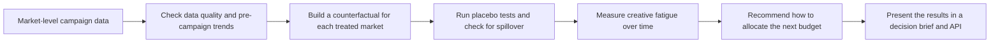

# BrandLift Lab

**Interference-aware measurement and budget decisions for brand advertising.**

BrandLift Lab is meant to be used for measuring whether a brand campaign caused incremental outcomes, not just whether exposed users converted. It simulates a multi market ad launch, constructs a synthetic counterfactual for each treated market, diagnoses creative fatigue and spillovers and recommends a risk aware budget allocation under diminishing returns.

## The question

> A brand campaign launched across six markets. I wanted to answer three practical questions:

> - Did the campaign generate additional brand actions?
> - When did repeated exposure begin to reduce its effectiveness?
> - How should the next $1 million be allocated across markets?

A simple comparison between exposed and unexposed users would be misleading because the two groups may differ before the campaign begins. A traditional user-level A/B test may also be unreliable when content spreads across geographic and network boundaries.

To address this, BrandLift Lab treats each market as the experimental unit, builds a counterfactual using comparable markets, and clearly reports the assumptions behind the results.


## What makes this project different?

- Builds a realistic counterfactual for each treated market using a weighted combination of comparable markets.
- Uses placebo tests to assess whether the measured lift is meaningful or could reasonably occur by chance.
- Checks how well the model fits before the campaign, so results are not trusted when the comparison is weak.
- Tests whether spillover into control markets would materially change the conclusion.
- Identifies when repeated exposure starts producing diminishing returns.
- Recommends a budget allocation while accounting for market coverage, capacity constraints, uncertainty, and diminishing returns.
- Combines statistical evidence with practical campaign considerations to produce a clear recommendation.

## houn it

```bash
python -m venv .venv
source .venv/bin/activate
pip install -e '.[dev]'
brandlift-lab
```

Open [http://localhost:8000](http://localhost:8000) or print with:

```bash
python -m brandlift_lab.cli --seed 17 --budget 1000000
```

## Architecture



## Repository map

## Repository map

| Repo loc | What it does |
|---|---|
| `src/brandlift_lab/simulation.py` | Creates the market-level campaign data used in the analysis. |
| `src/brandlift_lab/synthetic_control.py` | Builds a counterfactual for each treated market and runs placebo tests. |
| `src/brandlift_lab/diagnostics.py` | Checks for creative fatigue and possible spillover into control markets. |
| `src/brandlift_lab/optimizer.py` | Recommends how to allocate the next campaign budget. |
| `src/brandlift_lab/analysis.py` | Brings the results together and produces the final recommendation. |
| `src/brandlift_lab/api.py` | Makes the analysis available to the web application. |
| `web/` | Contains the interactive campaign results dashboard. |
| `tests/` | Tests the calculations and API behavior. |
| `docs/` | Explains the methodology, assumptions, limitations and interview narrative. |

## Responsible measurement

All data is synthetic. Market-level aggregation avoids personal data, but aggregation alone is not a privacy guarantee. The system reports model fit, placebo evidence, and sensitivity ranges rather than presenting a single causal number as unquestionable truth.
