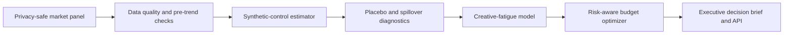

# BrandLift Lab

**Interference-aware measurement and budget decisions for brand advertising.**

BrandLift Lab is meant to be used for measuring whether a brand campaign caused incremental outcomes, not just whether exposed users converted. It simulates a multi market ad launch, constructs a synthetic counterfactual for each treated market, diagnoses creative fatigue and spillovers and recommends a risk aware budget allocation under diminishing returns.


## The question.

> A brand campaign launched in six markets. Did it generate incremental brand actions, where did creative fatigue appear and how should the next $1M be allocated?

A naive exposed vs unexposed comparison is biased by targeting and market differences. 
User-level A/B tests can also be contaminated when content crosses network and geographic boundaries. 
BrandLift Lab treats the market as the experimental unit and makes the assumptions inspectable.

## What makes this project different?

- Builds a realistic counterfactual for each treated market using a weighted combination of comparable markets.
- Uses placebo tests to assess whether the measured lift is meaningful or could reasonably occur by chance.
- Checks how well the model fits before the campaign, so results are not trusted when the comparison is weak.
Tests whether spillover into control markets would materially change the conclusion.
Identifies when repeated exposure starts producing diminishing returns.
Recommends a budget allocation while accounting for market coverage, capacity constraints, uncertainty, and diminishing returns.
Combines statistical evidence with practical campaign considerations to produce a clear recommendation.

## Run it

```bash
python -m venv .venv
source .venv/bin/activate
pip install -e '.[dev]'
brandlift-lab
```

Open [http://localhost:8000](http://localhost:8000) or print with:

```bash
python -m brandlift_lab.cli --seed 17 --budget 1000000
```

## Architecture



## Repository map

```text
src/brandlift_lab/
  simulation.py         realistic market-level campaign panel
  synthetic_control.py  constrained counterfactual and placebo inference
  diagnostics.py        fatigue and spillover sensitivity
  optimizer.py          saturation-aware budget allocation
  analysis.py           end-to-end decision policy
  api.py                 typed delivery layer
web/                     interactive evidence brief
tests/                   numerical and contract tests
docs/                    methods, assumptions, and interview guide
```

## Responsible measurement

All data is synthetic. Market-level aggregation avoids personal data, but aggregation alone is not a privacy guarantee. The system reports model fit, placebo evidence, and sensitivity ranges rather than presenting a single causal number as unquestionable truth.
